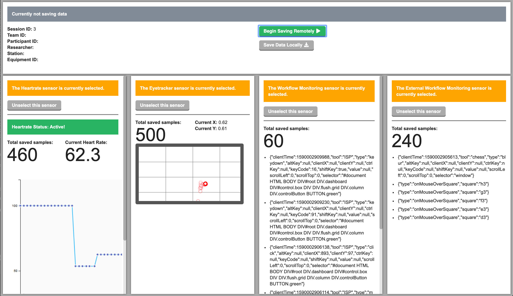

<h1>Integrated Sensors Platform</h1>
<h3>Streamlining Quantitative Physiological Data Collection and Analysis</h3>
<div>Harry X. Li, Vincent Mancuso, Sarah McGuire</div>
<br/>
<div><i>Presented at <a href="https://2022.hci.international/" target="_blank">HCII 2022</a></i></div>
</br>

https://harryli0088.github.io/integrated-sensors-platform/

[](static/Integrated_Sensors_Platform.pdf)
[](static/Integrated_Sensors_Platform_Presentation.pdf)



<h2>Distribution Statement</h2>

<p><b>DISTRIBUTION STATEMENT A. Approved for public release. Distribution is unlimited.</b></p>
<p>
  This material is based upon work supported by the Combatant Commands under Air Force Contract
  No. FA8702-15-D-0001. Any opinions, findings, conclusions or recommendations expressed in this 
  material are those of the author(s) and do not necessarily reflect the views of the Combatant Commands.

  © 2022 Massachusetts Institute of Technology. Delivered to the U.S. Government with Unlimited 
  Rights, as defined in DFARS Part 252.227-7013 or 7014 (Feb 2014). Notwithstanding any copyright
  notice, U.S. Government rights in this work are defined by DFARS 252.227-7013 or DFARS
  252.227-7014 as detailed above. Use of this work other than as specifically authorized by the U.S.
  Government may violate any copyrights that exist in this work.
</p>

## Creating a project

If you're seeing this, you've probably already done this step. Congrats!

```bash
# create a new project in the current directory
npm init svelte@next

# create a new project in my-app
npm init svelte@next my-app
```

> Note: the `@next` is temporary

## Developing

Once you've created a project and installed dependencies with `npm install` (or `pnpm install` or `yarn`), start a development server:

```bash
npm run dev

# or start the server and open the app in a new browser tab
npm run dev -- --open
```

## Testing

Testing was set up based off this guide: https://www.npmjs.com/package/svelte-jester and this issue: https://github.com/testing-library/react-testing-library/issues/422

```bash
npm run rest
```

## Building

Before creating a production version of your app, install an [adapter](https://kit.svelte.dev/docs#adapters) for your target environment. Then:

```bash
npm run build
```

> You can preview the built app with `npm run preview`, regardless of whether you installed an adapter. This should _not_ be used to serve your app in production.


## Deploying to Github Pages

Adapted from https://github.com/Sh031224/svelte-kit-github-page-example

1. Install ```adapter-static``` and ```gh-pages```
```
npm i -D @sveltejs/adapter-static@next gh-pages
```

2. Updated ```svelte.config.js```
```js
import static_adapter from '@sveltejs/adapter-static';

const config = {
  kit: {
    adapter: static_adapter({
      // default options are shown
      pages: 'build',
      assets: 'build',
      fallback: null
    }),
    paths: {
      base: process.env.NODE_ENV==="production" ? '/your-repo-name' : undefined,
    }
  }
};

export default config;
```

3. Add an empty ```.nojekyll``` file in your ```static/``` directory, otherwise GitHub Pages will ignore files with a leading underscore (ie ```_app/```)

4. Add a deploy script to ```package.json```
```json
{
  "scripts": {
    "deploy": "npm run build && npx gh-pages -d build -t true"
  }
}
```

5. Run the deploy script
```
npm run deploy
```
